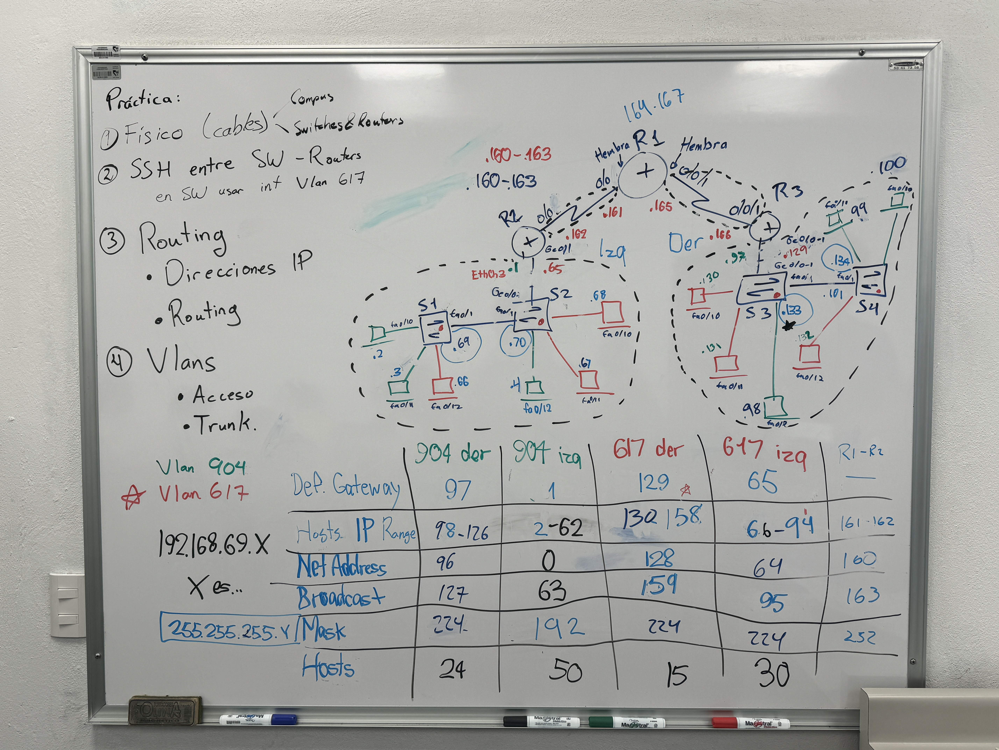

# ProyectoTelematica

## Topología de la red

# Práctica

1. **Físico (cables)**
2. **SSH entre SW - Routers**
   - En SW usar int Vlan 6/7
3. **Routing**
   - Direcciones IP
   - Routing
4. **Vlans**
   - Acceso
   - Trunk.

- VLAN 404
- **VLAN 6/7**
- IP Range: `192.168.69.X`
- Subnet Mask: `255.255.255.Y`
- Net Address
- Broadcast+
- Hosts

## Tabla de Hosts

| IP Range | Net Address | Broadcast | Hosts |
| -------- | ----------- | --------- | ----- |
| 97       | 128         | 159       | 30    |
| 98-126   | 96          | 127       | 30    |
| 129      | 160         | 191       | 30    |
| 130-158  | 128         | 159       | 30    |
| 159      | 192         | 223       | 30    |
| 160-162  | 160         | 163       | 3     |
| 163-191  | 160         | 191       | 30    |
| 192-224  | 192         | 223       | 30    |
| 225-253  | 224         | 255       | 30    |
| 254-255  | 224         | 255       | 2     |
